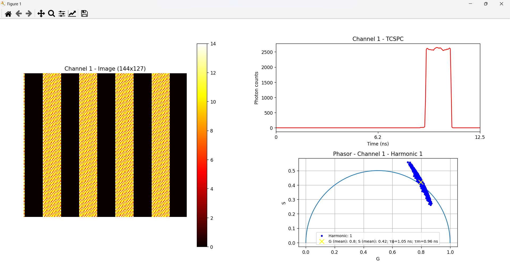

<a name="readme-top"></a>

<div align="center">
  <h1>FLIM Imager Data Export </h1>
</div>
<div align="center" style="padding: 0.5rem; border-radius: 5px">
  <a href="https://www.flimlabs.com/">
    
  </a>
</div>
<br>

<!-- TABLE OF CONTENTS -->
<details>
  <summary>Table of Contents</summary>
  <ol>
    <li>
      <a href="#introduction">Introduction</a>
    </li>
    <li><a href="#single-frame-imaging-file-format">Single-Frame Imaging File Format</a></li>
    <li><a href="#cumulative-imaging-file-format">Cumulative Imaging File Format</a></li>
    <li><a href="#single-frame-phasors-file-format">Single-Frame Phasors File Format</a></li>
    <li><a href="#cumulative-phasors-file-format">Cumulative Phasors File Format</a></li>
    <li><a href="#data-visualization">Data Visualization</a></li>
    <li><a href="#script-configuration">Script Configuration</a></li>
    <li><a href="#useful-links">Useful links</a></li>
    <li><a href="#license">License</a></li>
    <li><a href="#contact">Contact</a></li>
  </ol>
</details>

## Introduction

<div align="center">
    
</div>

[FLIM Imager](https://github.com/flim-labs/flim-imager-releases) software allows seamless export of imaging analyzed data to JSON files, with convenient plotting and visualization capabilities. This guide provides an in-depth exploration of the **JSON files structure**, offering a comprehensive understanding of how exported data is formatted and can be leveraged.

<p align="right">(<a href="#readme-top">back to top</a>)</p>

<hr>

## Single-Frame Imaging File Format

Here a detailed explanation of the exported single-frame JSON data file structure:

##### Header (Metadata):

The file structure starts with the **header** field, which contains the following metadata info:

- **type**: Information about the file type. In this case, "Frame". (_string_);
- **file_id**: ASCII values which uniquely identify the file type. In this case the matching string value is "IMF1". (_int[]_);
- **setup**: The microscope setup used (_Default_ or _Abberior_ configuration);
- **abberior_multichannel_assignment_mode**: Information about the STEDYCON multi-channel imaging reconstruction assigment (_Frame_, _Line_ or _Pixel_). This field is only present when in STEDYCON setup mode;
- **channels**: Information about enabled channels (_boolean[]_);
- **laser_period_ns**: Laser period in nanoseconds (_float_);
- **step**: Imaging type of experiment (Scouting/Imaging) (_string_);
- **reconstruction**: Imaging type of reconstruction (At the moment, only PLF/pixel-line-frame is supported) (_string_);
- **image_width**: Width of the acquired image in pixels (_int_);
- **image_height**: Height of the acquired image in pixels (_int_);

##### Data Records:

Following the _header_ data, **data** field contains the decay values for each pixels in the frame, structured as a _three-level array_:

- **1st Level**: An array containing one subarray related to the acquired data **acquisition channel** ;
- **2nd Level**: The subarray corresponding to the data acquisition channel contains as many subarrays as there are **total pixels** in the acquired frame;
- **3rd Level**: Each subarray corresponding to a pixel contains a variable number of subarrays, each with a length of 2. In these subarrays, the first index represents the bin index (pixels are binned into **256 bins**, with photon counts calculated for each bin), and the second index represents the decay value for that bin. These subarrays have a variable length because bins with null photon counts are omitted for optimization purposes.

<p align="right">(<a href="#readme-top">back to top</a>)</p>

<hr>

## Cumulative Imaging File Format

Here a detailed explanation of the exported global image JSON data file structure:

##### Header (Metadata):

The file structure starts with the **header** field, which contains the following metadata info:

- **type**: Information about the file type. In this case, "Global". (_string_);
- **file_id**: ASCII values which uniquely identify the file type. In this case the matching string value is "IMG1". (_int[]_);
- **setup**: The microscope setup used (_Default_ or _STEDYCON_ configuration);
- **abberior_multichannel_assignment_mode**: Information about the STEDYCON multi-channel imaging reconstruction assigment (_Frame_, _Line_ or _Pixel_). This field is only present when in STEDYCON setup mode;
- **channels**: Information about enabled channels (_boolean[]_);
- **laser_period_ns**: Laser period in nanoseconds (_float_);
- **step**: Imaging type of experiment (Scouting/Imaging) (_string_);
- **reconstruction**: Imaging type of reconstruction (At the moment, only PLF/pixel-line-frame is supported) (_string_);
- **image_width**: Width of the acquired image in pixels (_int_);
- **image_height**: Height of the acquired image in pixels (_int_);
- **frames**: Total number of acquired frames (_int_);

##### Data Records:

Following the _header_ data, **data** field contains the decay values for each pixels in the frame, structured as a _three-level array_:

- **1st Level**: An array containing as many subarrays as there are **active acquisition channels**;
- **2nd Level**: Each subarray corresponding to an acquisition channel contains as many subarrays as there are **total pixels** in the acquired frame;
- **3rd Level**: Each subarray corresponding to a pixel contains a variable number of subarrays, each with a length of 2. In these subarrays, the first index represents the bin index (pixels are binned into **256 bins**, with photon counts calculated for each bin), and the second index represents the decay value for that bin. These subarrays have a variable length because bins with null photon counts are omitted for optimization purposes. In this case (Cumulative Imaging), photon counts are cumulative sum of each frames counts for each bin.

<p align="right">(<a href="#readme-top">back to top</a>)</p>

<hr>

## Single-Frame Phasors File Format

Here a detailed explanation of the exported single-frame phasors JSON data file structure:

##### Header (Metadata):

The file structure starts with the **header** field, which contains the following metadata info:

- **type**: Information about the file type (Frame). (_string_);
- **file_id**: ASCII values which uniquely identify the file type ("IPF1" for Single frame export). (_int[]_);
- **setup**: The microscope setup used (_Default_ or _Abberior_ configuration);
- **abberior_multichannel_assignment_mode**: Information about the STEDYCON multi-channel imaging reconstruction assigment (_Frame_, _Line_ or _Pixel_). This field is only present when in STEDYCON setup mode;
- **channels**: Information about enabled channels (_boolean[]_);
- **laser_period_ns**: Laser period in nanoseconds (_float_);
- **step**: Imaging type of experiment (Scouting/Imaging) (_string_);
- **reconstruction**: Imaging type of reconstruction (At the moment, only PLF/pixel-line-frame is supported) (_string_);
- **image_width**: Width of the acquired image in pixels (_int_);
- **image_height**: Height of the acquired image in pixels (_int_);
- **frames**: Total number of acquired frames (_int_);
- **tau_ns**: tau (ns) value (_float_);
- **harmonics**: Number of phasor harmonics (_int_);

##### Data Records:

Following the _header_ field, **data** field contains the following information:

- **frame**: the number of the last frame acquired (_int_);
- **channel**: the acquisition channel for which the phasor data was calculated (_int_);
- **harmonic**: the harmonic for which the phasor data was calculated (_int_);
- **g_data**: an array which contains as many subarray as there are pixels in the acquired frame/image. Each pixel sub-array contains the **g** coordinate for the phasor representation;
- **s_data**: an array which contains as many subarray as there are pixels in the acquired frame/image. Each pixel sub-array contains the **s** coordinate for the phasor representation;

<p align="right">(<a href="#readme-top">back to top</a>)</p>

<hr>

## Cumulative Phasors File Format

Here a detailed explanation of the exported global phasors JSON data file structure:

##### Header (Metadata):

The file structure starts with the **header** field, which contains the following metadata info:

- **type**: Information about the file type (Global). (_string_);
- **file_id**: ASCII values which uniquely identify the file type ("IPG1" for Global export). (_int[]_);
- **setup**: The microscope setup used (_Default_ or _STEDYCON_ configuration);
- **abberior_multichannel_assignment_mode**: Information about the STEDYCON multi-channel imaging reconstruction assigment (_Frame_, _Line_ or _Pixel_). This field is only present when in STEDYCON setup mode;
- **channels**: Information about enabled channels (_boolean[]_);
- **laser_period_ns**: Laser period in nanoseconds (_float_);
- **step**: Imaging type of experiment (Scouting/Imaging) (_string_);
- **reconstruction**: Imaging type of reconstruction (At the moment, only PLF/pixel-line-frame is supported) (_string_);
- **image_width**: Width of the acquired image in pixels (_int_);
- **image_height**: Height of the acquired image in pixels (_int_);
- **frames**: Total number of acquired frames (_int_);
- **tau_ns**: tau (ns) value (_float_);
- **harmonics**: Number of phasor harmonics (_int_);

##### Data Records:

Following the _header_ field, **phasors_data** array contains dictionaries with the following information:

- **frame**: the number of the last frame acquired (_int_);
- **channel**: the acquisition channel for which the phasor data was calculated (_int_);
- **harmonic**: the harmonic for which the phasor data was calculated (_int_);
- **g_data**: an array which contains as many subarray as there are pixels in the acquired image. Each pixel sub-array contains the **g** coordinate for the phasor representation;
- **s_data**: an array which contains as many subarray as there are pixels in the acquired image. Each pixel sub-array contains the **s** coordinate for the phasor representation;

Following _phasors_data_ , **intensities_data** field contains the decay values for each pixels in the acquired image, structured as a _three-level array_:

- **1st Level**: An array containing one subarray corresponding to the **current active acquisition channel data** ;
- **2nd Level**: The active channel subarray contains as many subarrays as there are **total pixels** in the acquired image;
- **3rd Level**: Each subarray corresponding to a pixel contains a variable number of subarrays, each with a length of 2. In these subarrays, the first index represents the bin index (pixels are binned into **256 bins**, with photon counts calculated for each bin), and the second index represents the decay value for that bin. These subarrays have a variable length because bins with null photon counts are omitted for optimization purposes. In this case (Cumulative analysis), photon counts are cumulative sum of each frames counts for each bin.
<p align="right">(<a href="#readme-top">back to top</a>)</p>

<hr>

## Data Visualization

The script files are automatically downloaded along with the acquisition .bin file once the acquisition is complete and a file name and file path has been chosen.
When running the provided Python or Matlab scripts, the image reconstruction is performed. This process generates a visual representation of the acquired data based on the specified colormap. Along with the **image**, the script also produces the corresponding **global TCSPC plot**, which visualizes the time-correlated single-photon counting data across the entire sample. If the data is exported in _FLIM Phasors Mode_, the output also includes a **phasor plot** representing the frame or the globally acquired image, providing an additional graphical analysis of the lifetime distribution.

Follow the guide below if you wish to use the Python script:

- **Python script**:

  - Open the terminal and navigate to the directory where the saved files are located (it is advisable to save and group them in a folder):

    ```sh
    cd YOUR_DOWNLOADED_DATA_ROOT_FOLDER
    ```

  - Create a virtual environment using the command:
    ```sh
    python -m venv venv
    ```
  - Activate the virtual environment with the command:
    ```sh
    venv\Scripts\activate
    ```
  - Install the necessary dependencies listed in the automatically downloaded _requirements.txt_ with:
    ```sh
    pip install -r requirements.txt
    ```
  - Run your script with:
    ```sh
    python YOUR_SCRIPT_NAME.py
    ```
    <br>

- **Matlab script**:  
   Simply open your MATLAB command window prompt and, after navigating to the folder containing the script, type the name of the script to launch it.

<p align="right">(<a href="#readme-top">back to top</a>)</p>

<hr>

## Script Configuration

In the provided _Python and Matlab scripts_, users will find an initial section of the code containing **configurable variables** along with commented instructions explaining their function. This section allows users to adjust key parameters for analysis. Depending on the script type users can find:

- **file_path**: This variable lets users specify the imaging .JSON file to analyze. If the user wishes to change the file being processed, they can modify this variable to point to a different file.
- **imaging_file_path** (only in the single-frame phasors script): This variable lets users specify the imaging .JSON file to analyze. If the user wishes to change the file being processed, they can modify this variable to point to a different file.
- **phasors_file_path** (only in the phasors script): This variable lets users specify the phasors .JSON file to analyze. If the user wishes to change the file being processed, they can modify this variable to point to a different file.
- **channel**: Users can select which of the active channels to visualize during analysis. By default, this is set to the _first active channel_, but it can be changed to any other active channel.
- **colormap**: This variable allows users to set the colormap used in the image reconstruction. By default, the colormap is set to _hot_.
- **frame** (only in the single-frame reconstruction script): For frame-specific analysis, users can select which frame to analyze by specifying the frame number.
- **harmonic** (only in the phasors script): users can select which phasor harmonic to analyze by specifying the harmonic number.

<p align="right">(<a href="#readme-top">back to top</a>)</p>
<hr>

## Useful Links

To view the detailed **JSON data schemas** for each exported file type, <a href="../data/data-export-json-schemas.zip" download>download this ZIP</a>.

For more details about the project follow these links:

- [FLIM Imager introduction](../index.md)
- [FLIM Imager GUI guide](../v1.0.3/index.md)

<p align="right">(<a href="#readme-top">back to top</a>)</p>

## License

Distributed under the MIT License.

<p align="right">(<a href="#readme-top">back to top</a>)</p>

<!-- CONTACT -->

## Contact

FLIM LABS: info@flimlabs.com

Project Link: [FLIM Imager](https://github.com/flim-labs/flim-imager-releases)

<p align="right">(<a href="#readme-top">back to top</a>)</p>
