

  <h1>FLIM Imager v1.0</h1>

  

 

<!-- TABLE OF CONTENTS -->

  
Table of Contents

  <ol>
    <li>
      <a href="#introduction">Introduction</a>
    </li>
    <li><a href="#application-usage">Application Usage</a>
    <ul>
    <li><a href="#preview-mode">Preview Mode</a></li>
    <li><a href="#scouting-mode">Scouting Mode</a></li>
    <li><a href="#flim-mode">FLIM Mode</a></li>
    <li><a href="#flim-phasors-mode">FLIM Phasors Mode</a></li>
     <li><a href="#roi">ROI</a></li>
     <li><a href="#colormaps">Colormaps</a></li>
     <li><a href="#intensity-histogram">Intensity Histogram</a></li>
     <li><a href="#zoom">Zoom</a></li>
     <li><a href="#magnification">Magnification</a></li>
     <li><a href="#cps">CPS</a></li>
     <li><a href="#sbr">SBR</a></li>
     <li><a href="#settings">Settings</a></li>
    </ul></li>
    <li><a href="#diagnostic-messages">Diagnostic Messages</a></li>
    <li><a href="#data-export">Data export</a></li>
    <li><a href="#license">License</a></li>
    <li><a href="#contact">Contact</a></li>
  </ol>

<!-- ABOUT THE PROJECT -->

## Introduction

Welcome to [FLIM Imager](https://github.com/flim-labs/flim-imager) _v1.0_ usage guide. In this documentation section, you will find all the necessary information for the proper use of the application.
For a general introduction to the aims, technical requirements and installation of the project, read the [FLIM Imager Homepage](../index.md). You can also follow the [Data export](./data-export.md) dedicated guide link.

(<a href="#readme-top">back to top</a>)

<!-- USAGE EXAMPLES -->

## Application Usage

    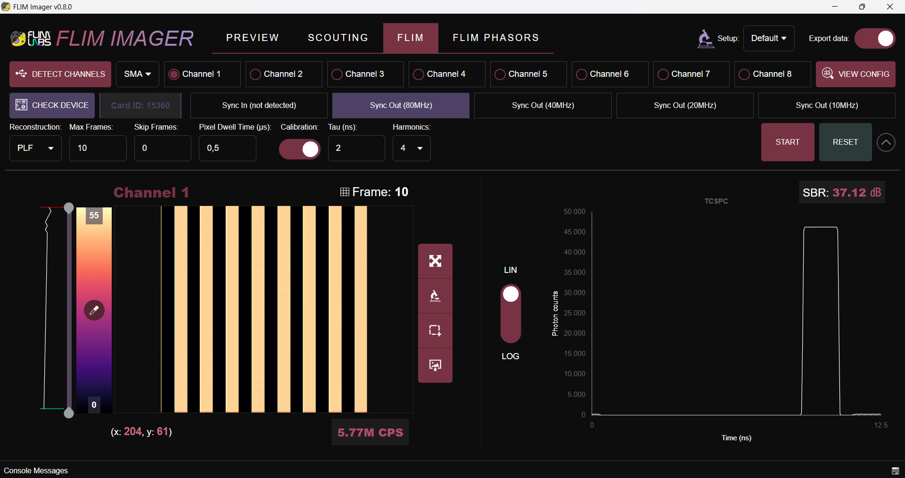

_FLIM Imager_ provides users with **four distinct analysis modes** to suit various experimental and analytical needs:

- **Preview Mode**;
- **Scouting Mode**;
- **FLIM Mode**;
- **FLIM Phasors Mode**

#### Preview Mode

    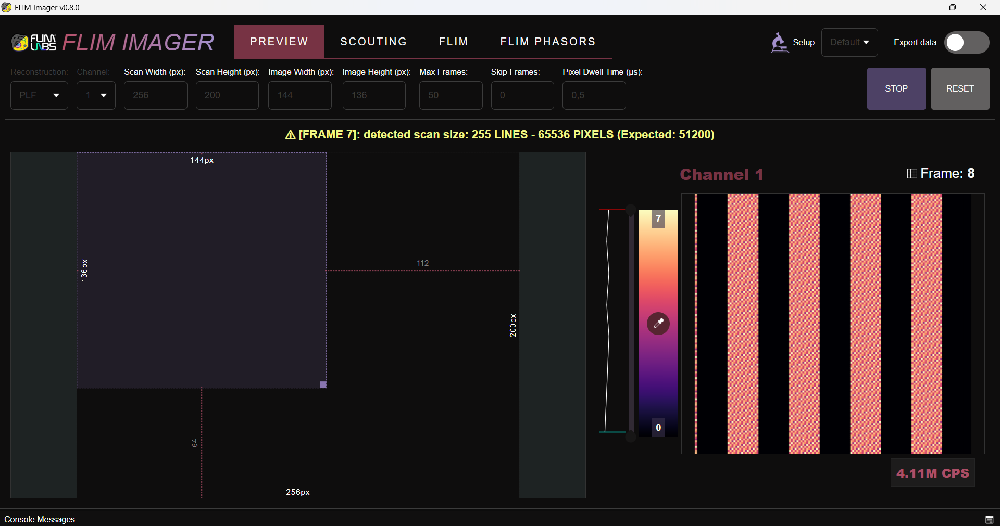

**Preview Mode** is designed to help users achieve the perfect calibration for their acquisition setup. This mode offers a convenient toolbox that allows users to easily **select and adjust the scan region (image)** they wish to acquire.

Key features of Preview Mode include:

- **Scan Region Adjustment**:
    Users can configure the dimensions of:

    - **Scan (width/height)**: The entire scannable area.
    - **Image (width/height)**: The specific section of the scan to be acquired.
- **Channel-by-Channel Exploration**:
    Preview Mode enables users to explore and adjust parameters one channel at a time for precise tuning.
- **Real-Time Feedback**:
    The software includes a practical warning system to alert users if the set scan dimensions differ from the dimensions detected by the processor. These warnings provide the actual scan dimensions, helping users adjust their parameters accordingly for optimal accuracy.

(<a href="#readme-top">back to top</a>)

#### Scouting Mode

    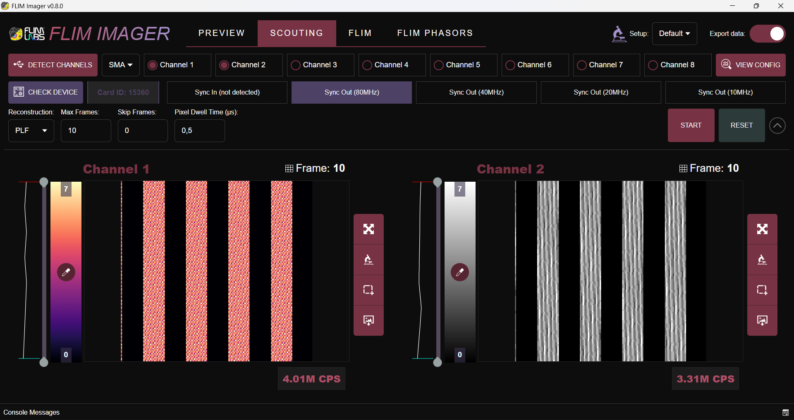

**Scouting Mode** provides users with an additional step to **explore the sample frame by frame** after calibrating the dimensions and offsets of the scan area.

Key features of Scouting Mode include:

- **Frame-by-Frame Exploration**:
    Unlike cumulative acquisition, in this mode, the pixel intensities of each frame are displayed individually without summation. This ensures a clear and distinct view of each acquired frame, allowing for precise inspection of the sample.

- **Simultaneous Dual-Channel Visualization**:
    Scouting Mode enables users to visualize two acquisition channels simultaneously, making it easier to compare and analyze different aspects of the sample in real-time.

This mode is designed to refine the exploration process and help users identify key features or regions of interest before moving to more in-depth analysis in _FLIM Mode_.

(<a href="#readme-top">back to top</a>)

#### FLIM Mode

    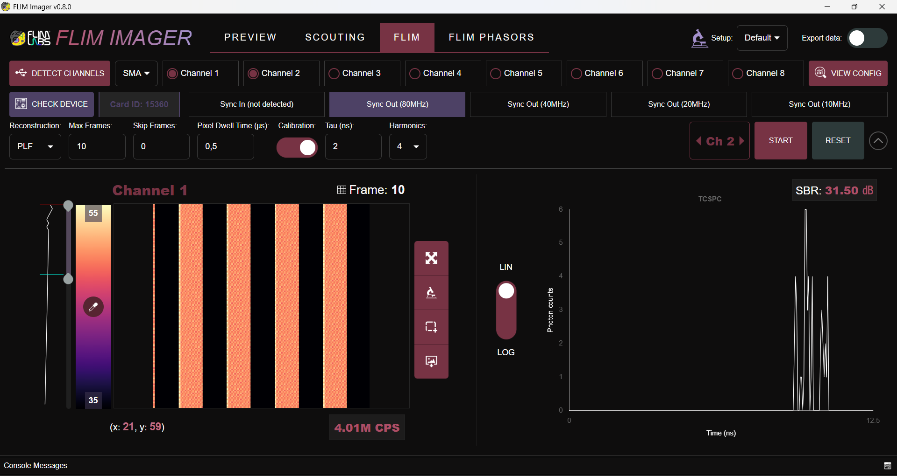

**FLIM Mode** is one of the software core features, enabling **in-depth analysis** of the acquired sample. This mode uses a cumulative image reconstruction approach, where the intensities of individual frames are summed during acquisition to provide a comprehensive view of the sample.

Key features of FLIM Mode include:

- **Cumulative Frame Acquisition**:
    The pixel intensities from all frames are added together during acquisition, offering a complete representation of the scanned area.

- **Global TCSPC Histogram**:
    Users can view the global _Time-Correlated Single Photon Counting_ (TCSPC) histogram in real-time, enabling decay analysis of the acquired sample during the acquisition process.

- **Pixel-by-Pixel Decay Analysis**:
    After the acquisition is complete, users can hover over individual pixels to view the TCSPC histogram for each pixel, providing a detailed spatial breakdown of decay characteristics.

- **Calibration**:
    Possibility to acquire in _Calibration Mode_ by specifying the number of _harmonics_ and the _tau value (ns)_ to obtain reference data for conducting phasor analysis on the _FLIM Phasors_ tab.    

- **Channel Visualization**:
    Users can analyze up to two acquisition channels. To ensure clarity and ease of visualization, the channels are displayed one at a time in a carousel-like interface, allowing users to toggle between them.

(<a href="#readme-top">back to top</a>)

#### FLIM Phasors Mode

    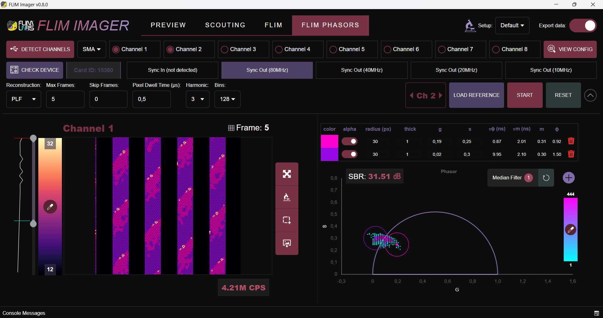

**FLIM Phasors Mode** is the other core feature of the software, designed to extract detailed insights from the acquired images for conducting **phasor analysis**. This mode enables a graphical representation of the _lifetime distribution_ in the form of a phasor plot, providing a powerful tool for lifetime characterization.

Key features of FLIM Phasors Mode include:

- **Phasor Plot Visualization**:
    View the lifetime distribution associated with the acquired image in an intuitive and interactive phasor plot.

- **Harmonics & Quantization**:
    Users can customize the phasor plot by selecting the specific harmonic to visualize and adjusting the quantization level (bins) applied to the represented points.

- **Circlets & Clustering**:
    Users can apply segmentation and _clustering_ directly on the phasor plot using customizable _circlets_. Circlets can be adjusted for position, radius, color, and alpha channel. Moreover, the corresponding clusters are dynamically visualized on the original image, with the pixels matching each cluster displayed in the circlet's selected color. This real-time feedback facilitates detailed spatial analysis of the clusters.

- **Median Filter**:
    To enhance the robustness of phasor-based analysis, a recursive _median filter_ can be applied to the 𝑔 and 𝑠 coordinates using a _3×3 kernel_. This operation effectively reduces noise while preserving spatial structures, ensuring a cleaner representation of fluorescence lifetime distributions. By iteratively refining the phasor data, the filter minimizes outlier influence and enhances segmentation accuracy.
      

(<a href="#readme-top">back to top</a>)

#### ROI

    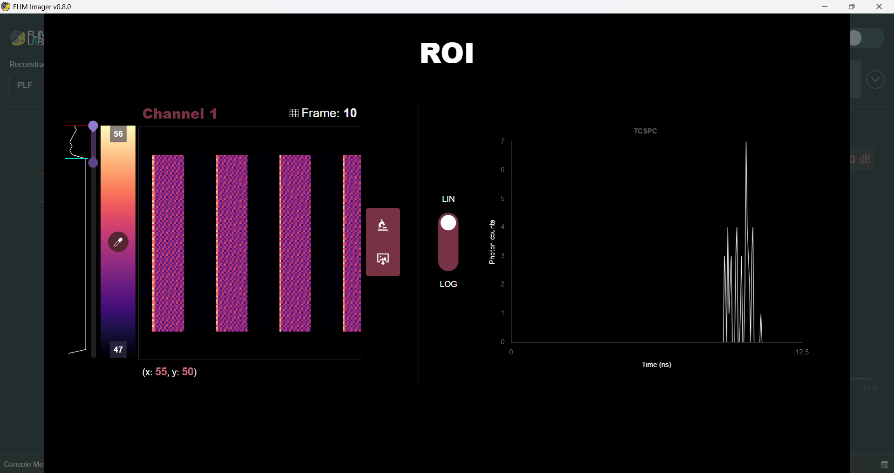

In both _Scouting_, _FLIM_ Mode and _FLIM Phasors Mode_, users can select a specific **Region of Interest (ROI)** from the acquired image after the acquisition is complete. This feature allows for detailed analysis of a particular area of the sample.

Key ROI capabilities include:
 - **Colormaps** for enhanced visualization.
 - **Intensity Histogram** for a graphical and intuitive representation of the image intensity map.
 - **Contrast** adjustments for fine-tuning image clarity.
 - **Magnification** tools to closely inspect the selected region.

In _FLIM Mode_, users can also view the global **TCSPC** histogram of the ROI and inspect the pixel-by-pixel TCSPC histograms, similar to how this functionality works for the entire image. Similarly, in _FLIM Phasors Mode_, users can view the corresponding **phasor plot** for the selected ROI, enabling a graphical representation of the lifetime distribution within the region of interest.

(<a href="#readme-top">back to top</a>)

#### Colormaps

    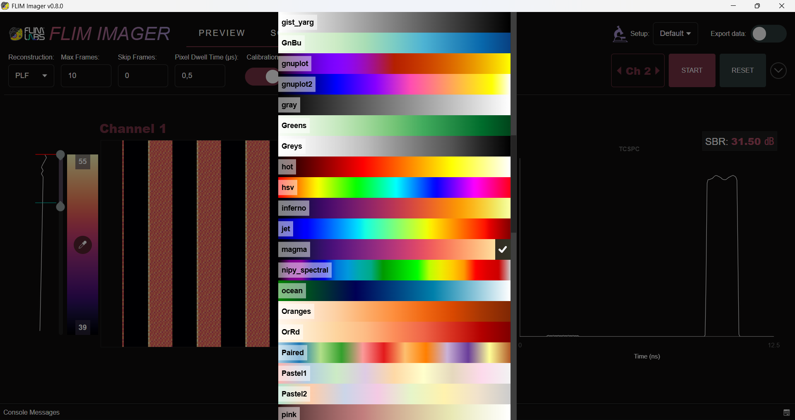

_FLIM Imager_ provides users with a versatile set of 83 **colormaps** that can be applied to the acquired images across all analysis modes. This functionality is available both in real-time during acquisition and in post-processing.

Key features include:

- **Extensive Colormap Options**:
    Users can choose from a library of _83_ colormaps to enhance the visualization of their data, catering to different analytical needs and preferences.

- **Contrast Adjustment**:
    The colormap feature is paired with a contrast adjustment tool, enabling users to fine-tune image clarity and highlight specific details of interest.

(<a href="#readme-top">back to top</a>)

#### Intensity Histogram

    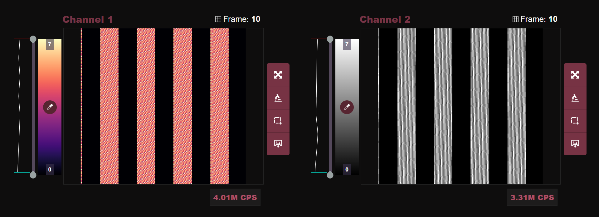

Available across all modes, the **intensity histogram** provides a quick and intuitive overview of image intensity distribution. Displayed alongside the colorbar, this _logarithmic-scale histogram_ enables users to assess intensity variations at a glance, facilitating contrast adjustments and data interpretation. By highlighting the overall brightness trends, it aids in identifying low-signal regions and optimizing visualization parameters for more accurate fluorescence analysis.

(<a href="#readme-top">back to top</a>)

#### Zoom

    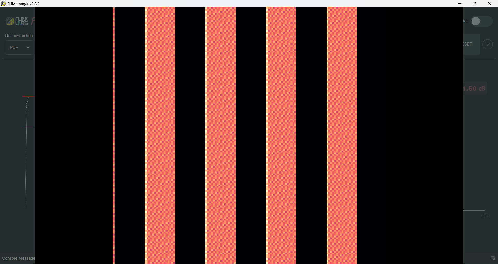

In both _Scouting_, _FLIM_ Mode and _FLIM Phasors Mode_, users have the ability to perform a **full-screen zoom** on the acquired image, enhancing their ability to closely examine details. This functionality is available both in real-time and post-processing modes.

(<a href="#readme-top">back to top</a>)

#### Magnification

    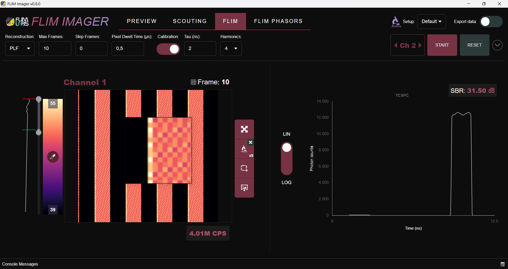

In both _Scouting_, _FLIM_ Mode and _FLIM Phasors Mode_, users can apply **magnification** to the acquired sample, allowing for detailed inspection of specific areas. This feature is available both in real-time and post-processing modes.
Users can choose from _4_ magnification levels:
- **x2**
- **x4**
- **x5**
- **x10**

(<a href="#readme-top">back to top</a>)

#### CPS

    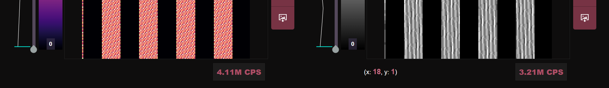

In all acquisition modes, users can monitor the **CPS (Photon Counts Per Second)** for each active channel, providing real-time feedback on signal intensity. This metric is essential for assessing acquisition quality and optimizing imaging parameters.

To enable CPS visualization, the _Pixel Dwell Time_ must be set, as it determines the temporal window over which photon counts are measured. 

(<a href="#readme-top">back to top</a>)

#### SBR

    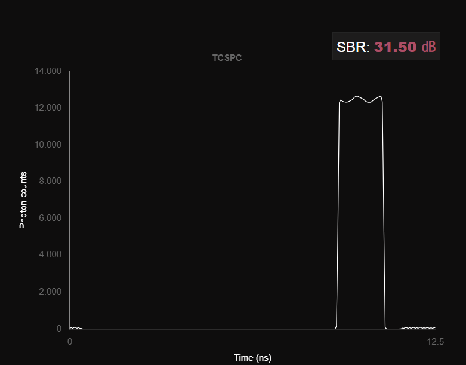

The **SBR (Signal-to-Background Ratio)** quantifies signal quality by comparing the peak fluorescence intensity to the background noise level. It is measured in _decibels (dB)_ and helps assess data reliability and contrast.

In _FLIM_ and _FLIM Phasors_ tabs, users can monitor the SBR in real-time during acquisition, enabling immediate evaluation of image quality. A higher SBR indicates a stronger signal relative to background noise, leading to more accurate lifetime measurements and phasor analysis.

(<a href="#readme-top">back to top</a>)

#### Settings

    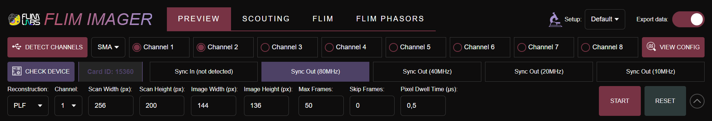

_FLIM Imager_ includes a comprehensive **settings** package that allows users to configure their acquisition parameters and hardware connections with ease.

Key features of the settings system include:

- **Customization**:
    Users can tailor various parameters to match their specific acquisition needs, ensuring seamless integration with their hardware setup.

- **Automatic Local Storage**:
    Every configured setting is automatically saved in the local storage, enabling the software to retain user preferences between sessions. This feature saves time by eliminating the need to reconfigure settings with each use.

Below is a list of configurable settings.

##### Setup
The **setup** setting allows users to run the software in **Default mode** or configure it for a specific microscope setup. Currently, the software supports a tailored configuration for **Abberior Stedycon**.

When selecting _Abberior Stedycon_, the acquisition and software settings are optimized for this microscope type. This includes default configurations such as:

- A maximum of _3 acquisition channels_;
- Laser frequency set to _40 MHz_;
- Channel type set to _SMA_;
- Reconstruction mode set to _PLF_.

Additionally, when using the _Abberior Stedycon setup_, users can select the desired **Multi-channel mode**:

- **Frame**: Acquired frames are alternately assigned to the active channels.
- **Line**: Acquired lines are alternately assigned to the active channels.
- **Pixel**: Individual pixels are alternately assigned to the active channels.

##### Channels
FLIM Imager supports the simultaneous acquisition of up to **8 channels**. While the software acquires data for all selected channels, the interface is **optimized to display a maximum of 2 channels at a time**. This design choice enhances UI clarity and usability during analysis.

Even though non-displayed channels are not visualized in the interface, their data is fully retained. These channels remain accessible for **data export**, allowing users to reconstruct and analyze them in post-processing.

To configure channels, users must specify the connection type being used (**USB** or **SMA**).

FLIM Imager also offers an **automated channel detection** feature. By clicking _DETECT CHANNELS_, the software scans for active connections and presents them to the user for confirmation. Upon approval, the detected channels are automatically configured, simplifying the setup process.

##### Laser Sync In / Sync Out
Users are required to specify the **laser frequency** used in their experiment. This selection, along with the chosen connection type (_USB_ or _SMA_), ensures that the correct **firmware** is triggered to support data acquisition with the configured settings.

In _Sync Out_ mode, users can manually select a frequency from the following options: **80 MHz**, **40 MHz**, **20 MHz**, or **10 MHz**.
In _Sync In_ mode, the software **automatically detects** the laser frequency being used, streamlining the configuration process.

##### Max Frames
Users can configure a predefined **number of frames** to acquire during an experiment. If this parameter is set to _0_ or left unconfigured, the software will continue acquiring frames until the user manually clicks the _STOP_ button.

This feature provides flexibility for both time-limited acquisitions and continuous, user-controlled data collection.

##### Skip Frames
Users have the option to configure a number of **initial frames to skip** before starting the actual data acquisition. This feature allows greater control over the data by enabling the user to discard any initial noisy or unstable frames, ensuring that only clean, relevant data is acquired for analysis.

  
##### Pixel Dwell Time (μs)
The **Pixel Dwell Time** defines the amount of time, measured in _microseconds_, that the laser beam illuminates a specific point on the specimen while the signal from that point is being detected.

This optional setting is particularly useful for performing advanced analysis and photon counting estimates over time, providing more precise control over the data acquisition process and enabling in-depth temporal analysis. Additionally, Pixel Dwell Time must be set to calculate **CPS** (photon counts per second)  and is also **required for acquisition in Line-Frame (LF) mode**.

In Pixel-Line-Frame mode, the minimum dwell time is _0.1 μs_, whereas in Line-Frame mode, the minimum dwell time is _1 μs_.

##### Scan Width (px) / Scan Height (px)

Configurable in _Preview_ Mode, the **Scan Width** and **Scan Height** settings allow users to define the overall dimensions of the **available scanned area**.

If the specified scan area does not match the actual dimensions detected by the processor, the user will receive a warning notification. This warning will indicate the actual dimensions detected, allowing the user to adjust the settings accordingly for accurate data acquisition.

##### Image Width (px) / Image Height (px)
Configurable in _Preview_ Mode, the **Image Width** and **Image Height** settings allow users to configure the specific **region of the scannable area** that they wish to actually acquire.

These settings work in conjunction with the **offset calculations**, enabling the processor to determine the exact portion of the image to reconstruct.

##### Calibration
Configurable in _FLIM_ Mode, the **Calibration** setting allow users to decide whether to generate a reference file for Phasors analysis or not. 

##### Harmonics
Configurable in _FLIM_ Mode, the **Harmonics** setting allow users to decide the number of harmonics for the reference file and so, for the Phasors analysis. This parameter is activated only when Calibration is enabled.

##### Tau (ns)
Configurable in _FLIM_ Mode, the **Harmonics** setting allow users to decide the tau (ns) value for the reference file and so, for the Phasors analysis. This parameter is activated only when Calibration is enabled.

Here a table summary of the configurable parameters:

| param  |description   |  data type | required  |
|---|---|---|---|
| **setup**  | the type of acquisition setup  | Default/Abberior  | true  |
| **abberiorMultichannelMode**  | the type of Abberior multi-channel image assigment  | Frame/Pixel  | true if in Abberior setup mode  |
| **enabledChannels**  | number of active channels  | number[]  | true  |
|  **channelType** | channels connection type   | USB/SMA |   true |
|  **frequencyMhz** | Laser frequency in Mhz  |  number | true  |
| **selectedFirmware**  | The selected firmware based on laser frequency and channels connection|  string | true |
|  **frameWidth** | Width of the scannable area (px)  | number  | true |
|  **frameHeight** |  Height of the scannable area (px) | number  |  true |
|  **imageWidth** | Width of the scan portion to acquire (px)  | number  | true  |
| **imageHeight**  | Height of the scan portion to acquire (px)  | number  | true  |
|  **offsetTop** | Distance of the image region from the top of the scanned area  | number  | true |
| **offsetRight** | Distance of the image region from the right of the scanned area   | number  | true |
| **offsetBottom**  | Distance of the image region from the bottom of the scanned area | number | true |
|  **offsetLeft** | Distance of the image region from the left of the scanned area  |  number | true  |
|  **maxFrames** | Max number of frames to acquire  | number/null  | false  |
| **skipFrames** | Number of initial frames to skip  | number/null  | false  |
| **dwellTime**  | Pixel dwell time in microseconds  | number  | required only to calculate CPS and in LF mode  |
| **exportData**  | Whether to export acquired data or not  | boolean  | false  |
| **exportPath**  | The folder destination for exported data  | string  | only if exportData is set to true  |
|  **exportFilename** | the filename for exported data  |  string | only if exportData is set to true  |
| **channelsToShow**  | channels to visualize in the GUI (up to 2)  |  number[] | true  |
| **colormaps** | colormaps settings for each channel |  object[] | false |
| **roiColormaps** | colormaps settings for each channel (ROI mode) |  object[] | false |
| **phasorColormaps** | colormaps settings for each channel (phasors plots) |  object[] | false |
| **phasorRoiColormaps** | colormaps settings for each channel (phasors plots  ROI mode) |  object[] | false |
| **intensityThresholds** | intensity thresholds for each channel |  object[] | false |
| **roiIntensityThresholds** | intensity thresholds for each channel (ROI mode) |  object[] | false |
| **curveLogMode** | scale mode for TCSPC plots for each channel (linear/log) |  boolean[] | false |
| **calibration** | whether to generate a reference file for phasors analysis or not |  boolean | false |
| **harmonics** | number of harmonics (1 to 4) for phasors analysis. Activated only when "calibration" is set to True |  number/null | required for calibration |
| **tauNs** | tau (ns) value for phasors analysis. Activated only when "calibration" is set to True |  number/null | required for calibration |
| **selectedHarmonic** | the harmonic to visualize in the phasor plot |  number | true |
| **selectedHarmonic** | the harmonic to visualize in the phasor plot (ROI mode) |  number | true |
| **bins** | The number of bins for phasor plot points quantization |  number | true |
| **roiBins** | The number of bins for phasor plot points quantization (ROI mode) |  number | true |

(<a href="#readme-top">back to top</a>)

## Diagnostic Messages

    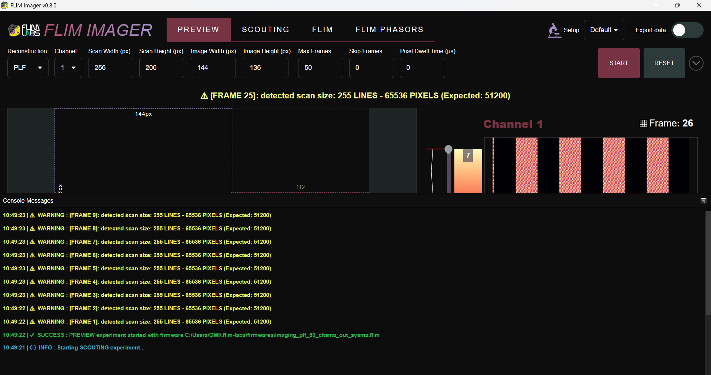

_FLIM Imager_ provides two modes for displaying **diagnostic messages**:

- **Toast Messages**: These are brief, non-intrusive notifications that appear temporarily on the screen to inform users of important events and errors.

- **Log Console**: For more persistent tracking, the software includes an extendable log console at the bottom of the application. This console retains a history of up to _500 log messages_, including **Info**, **Warning**, **Success**, and **Error** messages. Each message is timestamped for precise tracking of events.

The diagnostic messages help users stay informed about the system’s status and troubleshoot potential issues during data acquisition and analysis.

(<a href="#readme-top">back to top</a>)

## Data Export

    

In all modes, users have the option to **export acquired data** for further analysis in post-processing, independent of the software. When the _Export data_ option is selected, the user will be prompted before each acquisition to specify a **file path** and **filename** for the exported data. In FLIM and FLIM Phasors Mode user will be also prompted to decide whether to export frame by frame data and/or global image data.

The exported data varies depending on the analysis mode:

- **Preview Mode**: Only the **JPEG image** of the acquired sample is exported.
- **Scouting Mode**: The software exports _.json files for each acquired frame and active channel_, along with a _Python script_ for analyzing the frames.
- **FLIM Mode**: The exported data includes, depending on the option selected (frame and/or global):
   - _.json files for each acquired frame and active channel_;
   - _global cumulative file of all acquired frames_
   - _Python scripts_: one for analyzing individual frame data and one for analyzing global data (image + TCSPC).
   - _Matlab scripts_: one for analyzing individual frame data and one for analyzing global data (image + TCSPC).
- **FLIM Phasors Mode**: The exported data includes, depending on the option selected (frame and/or global):
   - _.json imaging files for each acquired frame and active channel_;
   - _global imaging cumulative file of all acquired frames_
   - _.json files with phasors data (g/s points) for each acquired frame, active channel and harmonic_;
   - _global phasors data (g/s points) file for each active channel_;
   - _Python scripts_: one for analyzing individual frame data and one for analyzing global data (image + TCSPC + Phasors).   
   - _Matlab scripts_: one for analyzing individual frame data and one for analyzing global data (image + TCSPC + Phasors). 

For detailed information on the structure of the .bin files and instructions for using the provided Python scripts, refer to:
- [FLIM Imager Data Export guide ](./data-export.md)

(<a href="#readme-top">back to top</a>)

## License

Distributed under the MIT License.

(<a href="#readme-top">back to top</a>)

<!-- CONTACT -->

## Contact

FLIM LABS: info@flimlabs.com

Project Link: [FLIM Imager](https://github.com/flim-labs/flim-imager)

(<a href="#readme-top">back to top</a>)

